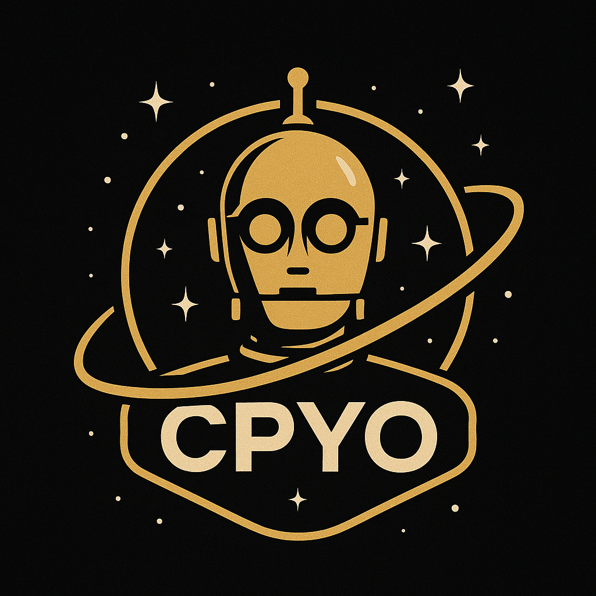

# CPYO Agentic Framework



## Overview

CPYO is a personal learning framework for building and experimenting with agentic AI systems. This project is in **active development** and serves as a hands-on tool for understanding the architecture and capabilities of agent-based AI systems.

> **Note**: This is a learning project and not intended for production use. Features and APIs may change frequently as development progresses.

## Purpose

This framework is being developed to:

- Learn about agentic AI architecture and design patterns
- Experiment with different agent types and capabilities
- Provide a playground for testing various LLM integrations
- Explore tool-calling mechanisms and agent reasoning

## Features

- 🤖 Multiple agent types (including ReAct agents)
- 🔧 Tool integration framework (Function tools, Python execution)
- 🔄 Event-driven architecture for agent interactions
- 🧠 Memory management for conversation history
- 🔌 Flexible provider system (currently supporting OpenAI)
- 🌐 Built-in tools for web search, calculations, and more

## Quick Start

```python
from cpyo import OpenAIProvider, FunctionTool, ReActAgent, Messages
import os

# Initialize provider with your API key
api_key = os.environ.get("OPENAI_API_KEY")
provider = OpenAIProvider(api_key=api_key)

# Define a simple tool
def calculator_impl(operation: str, a: float, b: float):
    if operation == "add":
        return {"result": a + b}
    # Add other operations as needed

calculator = FunctionTool(
    name="calculator",
    description="Perform basic calculations",
    function=calculator_impl,
)

# Create an agent with the tool
agent = ReActAgent(
    name="MathHelper",
    description="An assistant that can perform calculations",
    provider=provider,
    tools=[calculator]
)

# Run the agent
memory = Messages()
memory.add_system_message("You are a helpful assistant that can perform calculations.")
memory.add_user_message("What is 25 + 17?")

for event in agent.run(messages=memory, stream=True):
    # Handle events as needed
    print(event)
```

## Project Status

- [x] Basic agent framework
- [x] Tool calling integration
- [x] Event system for monitoring agent activity
- [x] OpenAI integration
- [ ] More agent types (in progress)
- [ ] Additional LLM providers
- [ ] Advanced memory management
- [ ] Agent benchmarking tools

## Development

This project is being actively developed. Feel free to explore the code and experiment with the framework. Documentation will improve as the project matures.

## TODO

- Implement agent type tool calling
- Add more comprehensive documentation
- Create additional examples
- Add tests
